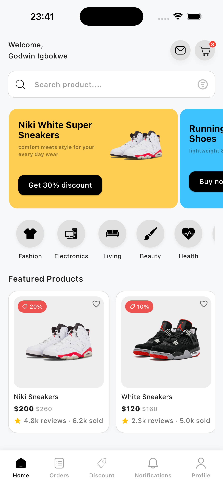
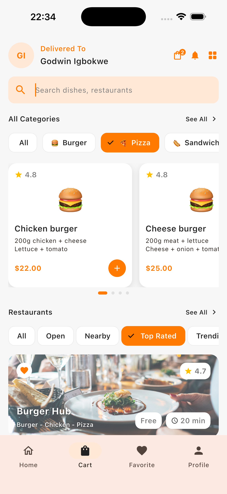

# Flutter UI Showcase

A growing collection of modern Flutter UI designs I build weekly to improve my skills and share my progress publicly.

## 📱 UI Screens

### 1. ShoeApp Home UI
- Product cards with ratings and prices  
- Category chips  
- Custom bottom nav  
- Clean layout inspired by real-world apps  

  

🔗 Folder: `shoeapp`

### 2. Delivery App UI
- Category filter chips
- Horizontal product sliders
- Restaurant list section
- Search bar and header
- Custom bottom navigation bar

  

🔗  Folder: `DeliverApp`

## 🔧 Tech Used
- Flutter (UI-focused)
- Dart
- Custom widgets
- pub.dev UI packages (when needed)
- Responsive layouts using MediaQuery/LayoutBuilder

## 🎯 Repository Goals
- Build clean, modern Flutter UIs consistently
- Improve spacing, alignment, and layout structure
- Strengthen my ability to translate UI/UX designs into real code
- Build a portfolio to attract recruiters and remote opportunities
- Track my growth publicly

## 📬 Feedback & Suggestions
I'm constantly learning.  
Feel free to open an issue or message me with:
- UI suggestions  
- Design ideas  
- Screens you'd like to see recreated  